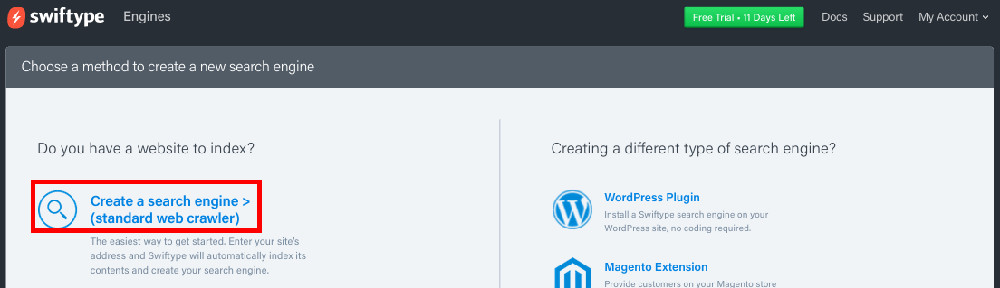
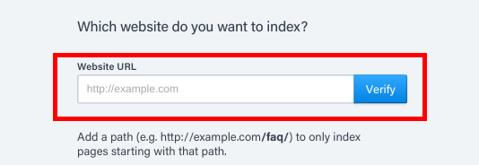
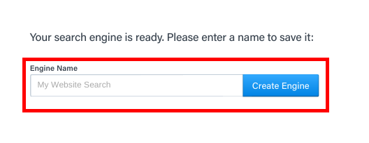
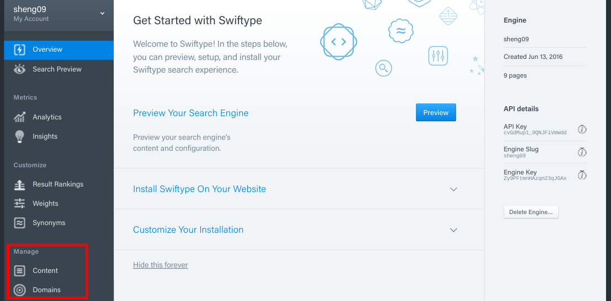
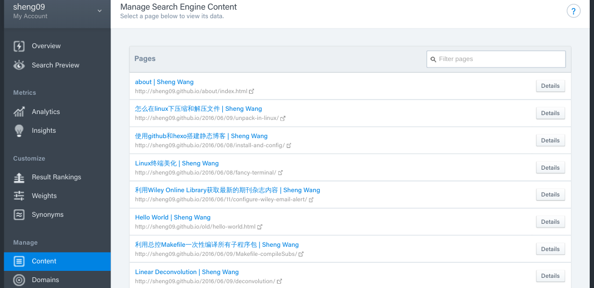
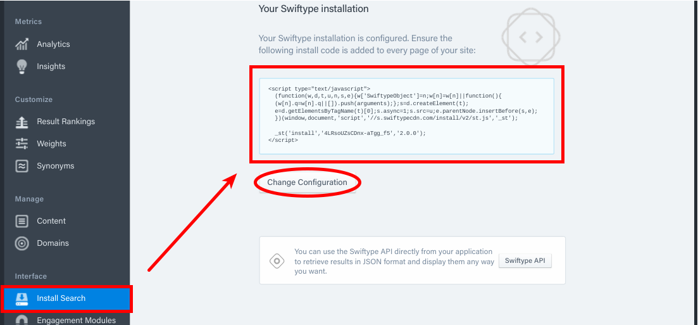

Landscape主题默认搜索位于右上角，且使用Google。编辑主题，可以利用[Swiftype](https://swiftype.com)搭建自己的站内搜索，并将搜索按钮置于菜单之中。

<!-- more -->
<!-- toc -->
## 创建Swiftype账号
注册[Swiftype](https://swiftype.com)账号，登陆，点击`Creat A New Engine`

输入网址

起个名字

随后，开始抓取网站内容。抓取结束之后在`Manage/Content`中查看抓取了那些内容。不想要的数据，可以手动在`Detials`里删除。



## 配置与获取Install Code
点击安装，配置外观，获得`Install Code`，复制保存以备后面使用。外观选用默认即可，也可以点击`Change Configuration`修改。


## Hexo-Landscape主题配置
在`landscape`主题下的`_config.yml`文件末尾添加如下代码：
``` yml
swift_search:
  enable: true
```
在`landscape`主题下的`_config.yml`中的`menu`部分添加`Search`：
``` yml
# Header
menu:
  Home: /
  Archives: /archives
  Search: /search
```
打开`landscape/layout/_partial/header.ejs`，将以下内容
``` html
    ...
    <div id="header-inner" class="inner">
      <nav id="main-nav">
        <a id="main-nav-toggle" class="nav-icon"></a>
        <% for (var i in theme.menu){ %>
          <a class="main-nav-link" href="<%- url_for(theme.menu[i]) %>"><%= i %></a>
        <% } %>
      </nav>
      <nav id="sub-nav">
        <% if (theme.rss){ %>
          <a id="nav-rss-link" class="nav-icon" href="<%- theme.rss %>" title="<%= __('rss_feed') %>"></a>
        <% } %>
        <a id="nav-search-btn" class="nav-icon" title="<%= __('search') %>"></a>
      </nav>
      <div id="search-form-wrap">
        <%- search_form({button: '&#xF002;'}) %>
      </div>
      ...
```
修改为：
``` html
    ...
    <div id="header-inner" class="inner">
      <nav id="main-nav">
        <a id="main-nav-toggle" class="nav-icon"></a>
        <% for (var i in theme.menu){ %>
          <% if (i != "Search"){ %>
            <a class="main-nav-link" href="<%- url_for(theme.menu[i]) %>"><%= i %></a>
          <% } else {%>
            <a class="main-nav-link st-search-show-outputs" href="<%- url_for(theme.menu[i]) %>"><%= i %></a>
          <% } %>
        <% } %>
        </nav>
      <nav id="sub-nav">
        <% if (theme.rss){ %>
          <a id="nav-rss-link" class="nav-icon" href="<%- theme.rss %>" title="<%= __('rss_feed') %>"></a>
        <% } %>
        <% if (theme.search_icon){ %>
        <a id="nav-search-btn" class="nav-icon st-search-show-outputs" title="<%= 
        __('search') %>"></a>
        <% } %>
      </nav>
    </div>
    ...
```
在`landscape/layout/_partial/`目录下创建文件`search.ejs`，写入以下内容。注意，其中的`Install code`脚本代码为自swiftype获取的那段。
``` html
<% if(theme.swift_search.enable) { %>
<div  id="container" class="page">
<div id="st-results-container" class="st-search-container" style="width:80%"> Searching... Please Wait</div>
<style>.st-result-text {
background: #fafafa;
display: block;
border-left: 0.5em solid #ccc;
-webkit-transition: border-left 0.45s;
-moz-transition: border-left 0.45s;
-o-transition: border-left 0.45s;
-ms-transition: border-left 0.45s;
transition: border-left 0.45s;
padding: 0.5em;
}
@media only screen and (min-width: 768px) {
.st-result-text {
  padding: 1em;
}
}
.st-result-text:hover {
border-left: 0.5em solid #ea6753;
}
.st-result-text h3 a{
color: #2ca6cb;
line-height: 1.5;
font-size: 22px;
}
.st-snippet em {
font-weight: bold;
color: #ea6753;
}</style>
<！--下面的代码要换成swiftype的install code--！>
<script type="text/javascript">
  (function(w,d,t,u,n,s,e){w['SwiftypeObject']=n;w[n]=w[n]||function(){
  (w[n].q=w[n].q||[]).push(arguments);};s=d.createElement(t);
  e=d.getElementsByTagName(t)[0];s.async=1;s.src=u;e.parentNode.insertBefore(s,e);
  })(window,document,'script','//s.swiftypecdn.com/install/v2/st.js','_st');
  
  _st('install','4LRsoUZsCDnx-aTgg_f5','2.0.0');
</script>
<% } %>
```
打开`landscape/layout/_partial/footer.ejs`，在最后一个`</div>`前，加入同样的`Install Code`。
``` html
<footer id="footer">
  <% if (theme.sidebar === 'bottom'){ %>
    <%- partial('_partial/sidebar') %>
  <% } %>
  <div class="outer">
    <div id="footer-info" class="inner">
      &copy; <%= date(new Date(), 'YYYY') %> <%= config.author || config.title %><br>
      <%= __('powered_by') %> <a href="http://hexo.io/" target="_blank">Hexo</a>
    </div>
    <script type="text/javascript">
      (function(w,d,t,u,n,s,e){w['SwiftypeObject']=n;w[n]=w[n]||function(){
      (w[n].q=w[n].q||[]).push(arguments);};s=d.createElement(t);
      e=d.getElementsByTagName(t)[0];s.async=1;s.src=u;e.parentNode.insertBefore(s,e);
      })(window,document,'script','//s.swiftypecdn.com/install/v2/st.js','_st');
      
      _st('install','4LRsoUZsCDnx-aTgg_f5','2.0.0');
    </script>
  </div>
</footer>
```

## 完成
所有操作已经完成，`hexo g`并`hexo s`查看结果，最后`hexo d`部署一下吧。

## 参考
利用swiftype为hexo添加站内搜索v2.0
[http://www.jerryfu.net/post/search-engine-for-hexo-with-swiftype-v2.html](http://www.jerryfu.net/post/search-engine-for-hexo-with-swiftype-v2.html)
点击弹出搜索框的事件配置
[http://blog.cloudyu.me/2015/blog-search/](http://blog.cloudyu.me/2015/blog-search/)
去掉右下角丑丑的Swiftype站内搜索按钮
[http://www.pangjian.info/2015/03/24/site-search-with-swiftype/#stq=&stp=0](http://www.pangjian.info/2015/03/24/site-search-with-swiftype/#stq=&stp=0)
