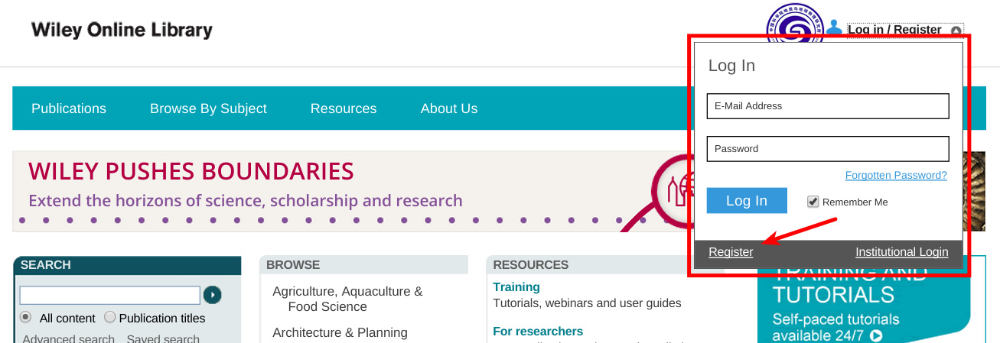
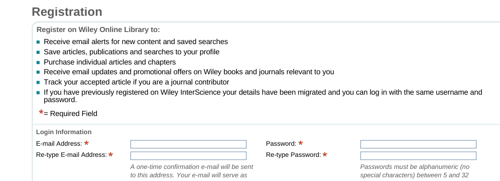
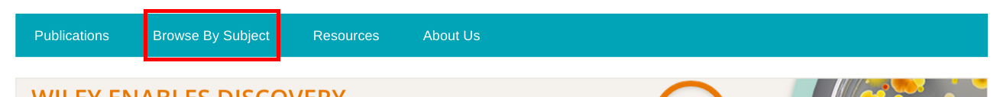
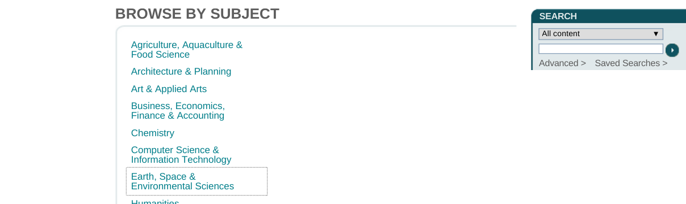
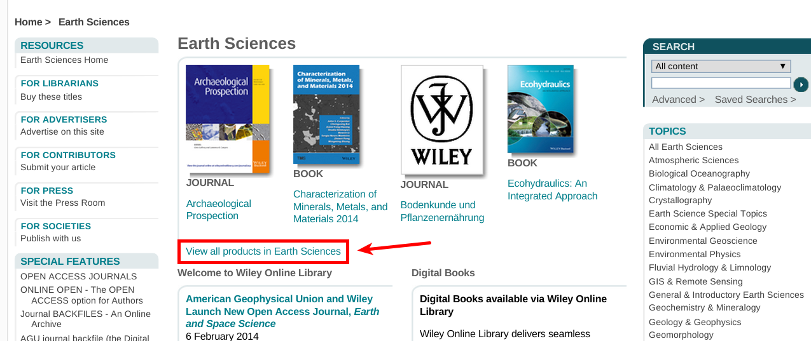
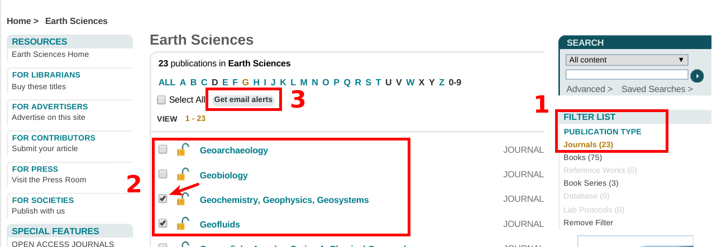
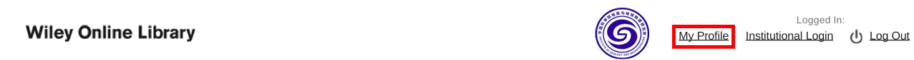
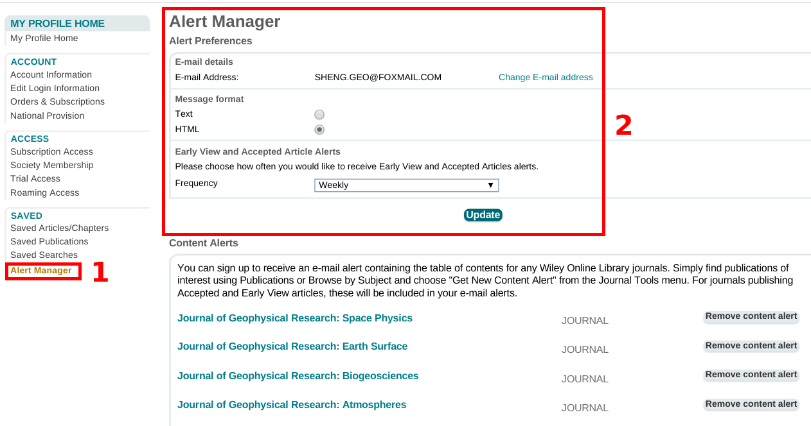
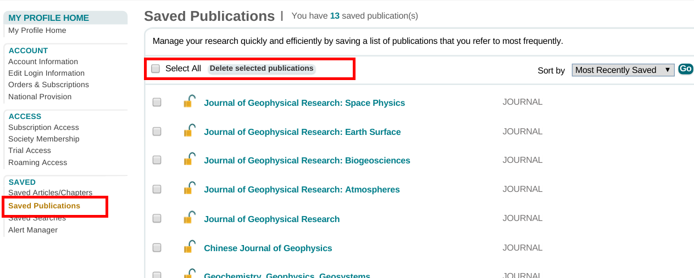

做为一名科学研究从业者，阅读期刊文章是不断学习，提升自我必不可少的环节。阅读最前沿的科研文章，可以让你紧跟研究潮流，学习最新的方法，发现最需要解决的科学问题和技术探索。甚至，阅读文献是和作者建立交流联系最为直接的垫脚石。如果你已经好久没有阅读最新的文献了，那么你将极有可能遇到很大的麻烦。利用网络资源，可以实时获取最新的研究进展和成果。但是，面对海量的期刊杂志，手动查看最新的内容，很容易让人对科研失去兴趣和动力，特别遇到不可抗逆的网络故障。值得庆幸的是，各大出版商以及不同的科学组织机构都提供了用户提醒功能，实时将最新的研究动态整理好发送至用户邮箱。本文将介绍如何利用Wiley在线图书馆获取最新的研究内容提醒。
<!-- more -->

## 注册
首先，你需要用于一个[Wiley Online Library](http://onlinelibrary.wiley.com/)账户，账户邮箱选择常用的邮箱，以方便接收查看提醒内容。如果你已经拥有一个账户，那么请忽略以下注册内容。

填写个人信息：

## 选择期刊
完成Wiley Online Library注册之后，登陆自己的账号。在主页点击[Browse By Subject](http://onlinelibrary.wiley.com/browse/subjects)：

选择自己的学科领域：

查看学科内所有资源列表：

在资源列表中，首先选择我们资源类型为Journals，因为我们需要的邮件提醒内容是最新发表的文章；随后，勾选自己需要的期刊；最后，点击`Get email alerts`。至此，Wiley Online Library就会将所选期刊的更新内容整理好，发送到账户注册邮箱。

## 设置提醒
进入`My Profile`，点击`Alert Manager`，可以设置接收提醒的邮箱地址，提醒格式(Text文本还是Html网页)，提醒时间间隔。此外，点击期刊列表后的`Remove content alert`可以关闭对应期刊的提醒。

在`Saved Publications`中可以看到自己勾选的所有期刊，可以勾选不需要提醒的期刊，点击`Delete selected publications`一次性清理。

## Apple用户
Wiley开发了移动客户端，涵盖了大部分的期刊杂志。如果你是Apple用户，可以在[Appstore](https://itunes.apple.com/us/developer/wiley-publishing/id334132751?iPhoneSoftwarePage=6#iPhoneSoftwarePage)中搜索期刊名，下载之后登陆Wiley Online Library账号，并开启提醒。
