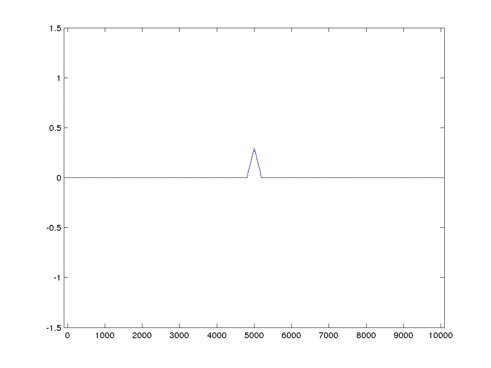
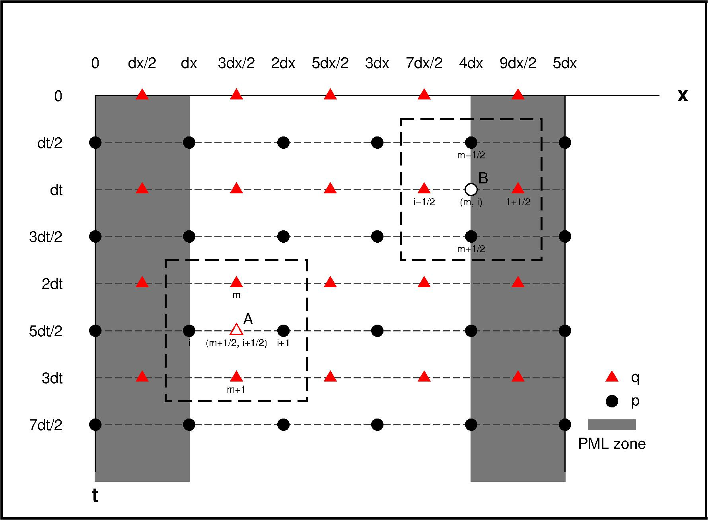

本文介绍了声波方程的PML吸收边界有限差分模拟，并利用一维模型例子加以说明。

<!-- more -->
<!-- toc -->

## 控制方程
一维空间下，一阶声波方程可以写成以下形式：$ $

$$
\begin{eqnarray}
    \begin{cases}
        \frac{\partial p }{\partial t} & = & -\rho v^2\frac{\partial q}{\partial x} \\
        \frac{\partial q }{\partial t} & = & -\frac{1}{\rho} \frac{\partial p}{\partial x}
    \end{cases}
\end{eqnarray}
$$

针对PML区域，控制方程如下：

$$
\begin{eqnarray}
    \begin{cases}
        \frac{\partial p }{\partial t}+d(x)p & = & -\rho v^2\frac{\partial q}{\partial x}\\
        \frac{\partial q }{\partial t}+d(x)q & = & -\frac{1}{\rho} \frac{\partial p}{\partial x}
    \end{cases}
\end{eqnarray}
$$

$$
\begin{eqnarray}
    \begin{cases}
        D_t p_B + d(x_B) p_B & = & - \rho v^2 D_x q_B \\
        D_t q_A + d(x_A)q_A & = & -\frac{1}{\rho}D_x p_A
    \end{cases}
\end{eqnarray}
$$

## 交错网格
参考Virieux([1984](http://library.seg.org/doi/abs/10.1190/1.1441605), [1986](http://library.seg.org/doi/abs/10.1190/1.1442147))，构建交错网格如下：


在二阶差分精度下，对于Ｂ点可以推导：

$$
\begin{eqnarray}
        D_t p_B + d(x_B)p_B & = & - \rho v^2 D_x q_B
\end{eqnarray}
$$

$$
\begin{eqnarray}
\begin{aligned}
        \Rightarrow\frac{1}{\Delta t} [ p(x_i, t_{m+1/2}) - p(x_i, t_{m-1/2}) ] + & \frac{d(x_i)}{2} [p(x_i, t_{m+1/2}) + p(x_i, t_{m-1/2}) ] \\
        & = -\frac{\rho v^2}{\Delta x} [ q(x_{i+1/2}, t_m) - q(x_{i-1/2}, t_m) ]
\end{aligned}
\end{eqnarray}
$$

$$
\begin{eqnarray}
  \Rightarrow
  \begin{cases}
        p(x_i, t_{m+1/2}) & = & c_1p(x_i, t_{m-1/2})  + c_2 [ q(x_{i+1/2}, t_m) - q(x_{i-1/2}, t_m) ]\\
        c_1 & = & \frac{2-\Delta t d(x_i)}{2+\Delta t d(x_i)} \\
        c_2 & = & -\frac{2\rho v^2 \Delta t}{\Delta x [2+ \Delta td(x_i)]} \\
  \end{cases}
\end{eqnarray}
$$

同样的，可以推导Ａ点：
$$
\begin{eqnarray}
    D_t q_A + d(x_A)q_A & = & -\frac{1}{\rho}D_x p_A
\end{eqnarray}
$$
$$
\begin{eqnarray}
  \begin{aligned}
    \Rightarrow
    \frac{1}{\Delta t} [q(x_{i+1/2},t_{m+1})- q(x_{i+1/2},t_{m}) ]& +
    \frac{d(x_{i+1/2})}{2} [q(x_{i+1/2},t_{m+1})+ q(x_{i+1/2},t_{m}) ]\\
    &=  -\frac{1}{\rho \Delta x} [p(x_{i+1}, t_{m+1/2}) - p(x_i, t_{m+1/2})]
  \end{aligned}
\end{eqnarray}
$$

$$
\begin{eqnarray}
  \Rightarrow
    \begin{cases}
      q(x_{i+1/2},t_{m+1}) & = & f_1q(x_{i+1/2},t_{m}) + f_2[p(x_{i+1}, t_{m+1/2}) - p(x_i, t_{m+1/2})] \\
      f_1 & = &  \frac{2-\Delta t d(x_{i+1/2})}{2+\Delta t d(x_{i+1/2})}\\
      f_2 & = & -\frac{2\Delta t}{\rho \Delta x[2+ \Delta td(x_{i+1/2})]}
    \end{cases}
\end{eqnarray}
$$

故而，波场递推关系为：

$$
\begin{equation}
  \begin{cases}
    q(t=0) \\
    p(t=\Delta t/2)
  \end{cases}
  \Rightarrow
    \color{red}{q(t=\Delta t)}
  \\\Rightarrow
  \begin{cases}
    \color{red}{q(t=\Delta t)} \\
    p(t=\Delta t/2)
  \end{cases}
  \Rightarrow \color{blue}{p(t=3\Delta t/2)}
  \\\Rightarrow
  \begin{cases}
    \color{red}{q(t=\Delta t)} \\
    \color{blue}{p(t=3\Delta t/2)}\\
  \end{cases}
  \Rightarrow \color{green}{q(t=2\Delta t)}
  \\\Rightarrow
  \begin{cases}
    \color{green}{q(t=2\Delta t)} \\
    \color{blue}{p(t=3\Delta t/2)}
  \end{cases}
  \Rightarrow ............\\
  ...

  \end{equation}
$$


## $d(x)$的选择

$$
d(x) = log(\frac{1}{R}) \frac{3v}{2\delta}(\frac{x}{\delta})^2
$$

$R$推荐取0.001，$\delta$为PML层厚[[Collino and Tsogka 2001](http://library.seg.org/doi/abs/10.1190/1.1444908)]。

## 实现


``` matlab
% Matlab
%Parameters%
  clear;close all; clc
  n_pml = 10;
  nx = 1020; dx  = 10; x = (-n_pml:nx-1-n_pml) * dx; %(1:11) and (1010:1020) are PML zone
  nt = 700;  dt  = 1.0e-2;
  v  = 1000.0; rho = 1500;
  R = 0.001; delta = n_pml * dx; d_const = (3.0*v/2.0/delta)*log(1.0/R) /(delta*delta);
%d(x)%
  d_pLeft  = ( (-n_pml:0)*dx ) .^2 * d_const;
  d_pRight = ( (0:n_pml)*dx  ) .^2 * d_const;
  d_qLeft  = ( (-n_pml:-1)*dx +dx/2 ) .^2 * d_const;
  d_qRight = ( (1:n_pml)*dx -dx/2   ) .^2 * d_const;
  d_p      = [d_pLeft zeros(1,nx-2*n_pml-2) d_pRight];
  d_q      = [d_qLeft zeros(1,nx-2*n_pml-1) d_qRight];
  c1       = (2.0-dt*d_p)./(2.0+dt*d_p);
  c2       = (-2.0*rho*v*v*dt)./dx./(2.0+dt*d_p);
  f1       = (2.0-dt*d_q)./(2.0+dt*d_q);
  f2       = ( (-2.0*dt)./rho./dx) ./ (2.0+dt.*d_q);
%source%
  f_wave = 0.5*2.0 * pi ;
  n_stop = floor( 2.0 * pi / f_wave   / dt );
  src= [ sin( (0:n_stop)*dt*f_wave) zeros(1,nt) ]; %source

  p  = zeros(2,nx); q  = zeros(2,nx-1); %initial conditions
  new = 1; old = 2;
  figure
  xmin = min(x); xmax = max(x);
%main loop%
  for it = 1:nt
      %  1   2   3   4   5  ...
      %--q---q---q---q---q--...
      %p---p---p---p---p---p...
      %1   2   3   4   5   6...
      p(old,511) = src(it)+p(old,511);
      for ix = 1:nx-1
          q(new,ix) = f1(ix)* q(old,ix) + f2(ix) * ( p(old,ix+1) - p(old,ix) );
      end
      for ix = 2:nx-1
          p(new,ix) = c1(ix)* p(old,ix) + c2(ix) * ( q(new,ix) - q(new,ix-1) );
      end

      %p(new,nx) = p(new,nx-1); % free boundary
      %p(new,1)  = p(new,2);
      p(new,nx) = 0.0; % rigid boundary
      p(new,1)  = 0.0;
      plot(x,p(old,:));
      axis( [xmin xmax -1.5 1.5] );
      pause(0.001);
      tmp = old; old = new; new = tmp;
  end
```

## 参考文献
[Virieux J. SH-wave propagation in heterogeneous media: Velocity-stress finite-difference method[J]. Geophysics, 1984, 49(11): 1933-1942.](http://library.seg.org/doi/abs/10.1190/1.1441605)
[Virieux J. P-SV wave propagation in heterogeneous media: Velocity-stress finite-difference method[J]. Geophysics, 1986, 51(4): 889-901.](http://library.seg.org/doi/abs/10.1190/1.1442147)
[Collino, Francis, and Chrysoula Tsogka. "Application of the perfectly matched absorbing layer model to the linear elastodynamic problem in anisotropic heterogeneous media." Geophysics 66.1 (2001): 294-307.](http://library.seg.org/doi/abs/10.1190/1.1444908)
