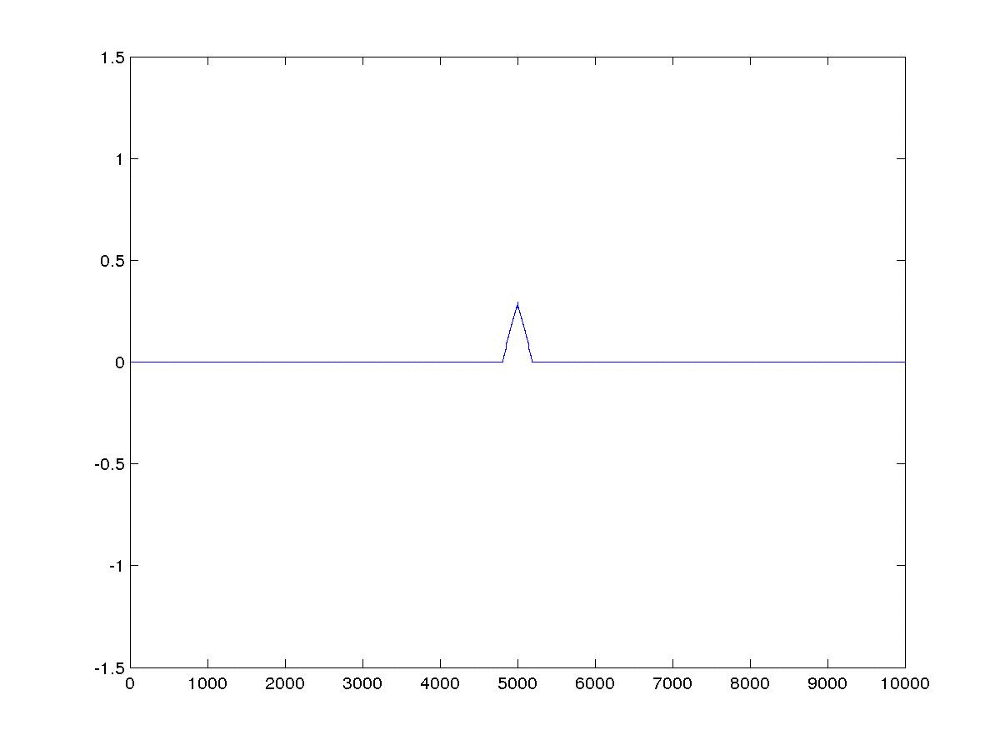
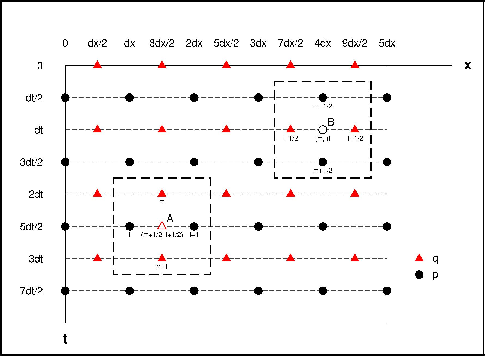

本文介绍了一阶声波方程有限差分模拟，并利用一维模型例子加以说明。


<!-- more -->
<!-- toc -->

## 控制方程
一维空间下，一阶声波方程可以写成以下形式：$ $

$$
\begin{eqnarray}
    \begin{cases}
        \frac{\partial p }{\partial t} & = & -\rho v^2\frac{\partial q}{\partial x} + f\\
        \frac{\partial q }{\partial t} & = & -\frac{1}{\rho} \frac{\partial p}{\partial x} + q_0
    \end{cases}
\end{eqnarray}
$$

在无外力作用无信号输入情况下，声波方程及其差分形式为：

$$
\begin{eqnarray}
    \begin{cases}
        \frac{\partial p }{\partial t} & = & -\rho v^2\frac{\partial q}{\partial x}\\
        \frac{\partial q }{\partial t} & = & -\frac{1}{\rho} \frac{\partial p}{\partial x}
    \end{cases}
\end{eqnarray}
$$

$$
\begin{eqnarray}
    \begin{cases}
        D_t p_B & = & - \rho v^2 D_x q_B \\
        D_t q_A & = & -\frac{1}{\rho}D_x p_A
    \end{cases}
\end{eqnarray}
$$

## 交错网格
参考Virieux([1984](http://library.seg.org/doi/abs/10.1190/1.1441605), [1986](http://library.seg.org/doi/abs/10.1190/1.1442147))，构建交错网格如下：


在二阶差分精度下，对于Ｂ点可以推导：

$$
\begin{eqnarray}
        D_t p_B & = & - \rho v^2 D_x q_B \\
        \Rightarrow \frac{1}{\Delta t} [ p(x_i, t_{m+1/2}) - p(x_i, t_{m-1/2}) ] & = &  -\frac{\rho v^2}{\Delta x} [ q(x_{i+1/2}, t_m) - q(x_{i-1/2}, t_m) ]
\end{eqnarray}
$$

$$
\begin{eqnarray}
        \Rightarrow p(x_i, t_{m+1/2}) & = & p(x_i, t_{m-1/2})  - \frac{\rho v^2 \Delta t}{\Delta x} [ q(x_{i+1/2}, t_m) - q(x_{i-1/2}, t_m)
\end{eqnarray}
$$

同样的，可以推导Ａ点：
$$
\begin{eqnarray}
    D_t q_A & = & -\frac{1}{\rho}D_x p_A \\
    \Rightarrow \frac{1}{\Delta t} [q(x_{i+1/2},t_{m+1})- q(x_{i+1/2},t_{m}) ]& = & -\frac{1}{\rho \Delta x} [p(x_{i+1}, t_{m+1/2}) - p(x_i, t_{m+1/2})]
\end{eqnarray}
$$

$$
\begin{eqnarray}
    \Rightarrow q(x_{i+1/2},t_{m+1}) & = & q(x_{i+1/2},t_{m}) -\frac{\Delta t}{\rho \Delta x} [p(x_{i+1}, t_{m+1/2}) - p(x_i, t_{m+1/2})]
\end{eqnarray}
$$

故而，波场递推关系为：

$$
\begin{equation}
  \begin{cases}
    q(t=0) \\
    p(t=\Delta t/2)
  \end{cases}
  \Rightarrow
    \color{red}{q(t=\Delta t)}
  \\\Rightarrow
  \begin{cases}
    \color{red}{q(t=\Delta t)} \\
    p(t=\Delta t/2)
  \end{cases}
  \Rightarrow \color{blue}{p(t=3\Delta t/2)}
  \\\Rightarrow
  \begin{cases}
    \color{red}{q(t=\Delta t)} \\
    \color{blue}{p(t=3\Delta t/2)}\\
  \end{cases}
  \Rightarrow \color{green}{q(t=2\Delta t)}
  \\\Rightarrow
  \begin{cases}
    \color{green}{q(t=2\Delta t)} \\
    \color{blue}{p(t=3\Delta t/2)}
  \end{cases}
  \Rightarrow ............\\
  ...

  \end{equation}
$$


## 实现


``` matlab
    % Matlab
    clear;close all; clc
    nx = 1000;   dx  = 10; x = (0:nx-1) * dx;
    nt = 2500;   dt  = 1.0e-2;
    v  = 1000.0; rho = 1500;

    f_wave = 0.5*2.0 * pi ;
    n_stop = floor( 2.0 * pi / f_wave   / dt );
    src= [ sin( (0:n_stop)*dt*f_wave) zeros(1,nt) ]; %source

    p  = zeros(2,nx); q  = zeros(2,nx-1); %initial conditions
    new = 1; old = 2;
    c_q = -1.0*dt/rho/dx; c_p = -1.0*rho*v*v*dt/dx;
    figure
    for it = 1:nt
        %  1   2   3   4   5  ...
        %--q---q---q---q---q--...
        %p---p---p---p---p---p...
        %1   2   3   4   5   6...
        p(old,501) = src(it)+p(old,501);
        for ix = 1:nx-1
            q(new,ix) = q(old,ix) + c_q * ( p(old,ix+1) - p(old,ix) );
        end
        for ix = 2:nx-1
            p(new,ix) = p(old,ix) + c_p * ( q(new,ix) - q(new,ix-1) );
        end

        p(new,nx) = p(new,nx-1); % free boundary
        p(new,1)  = p(new,2);
        %p(new,nx) = 0.0; % rigid boundary
        %p(new,1)  = 0.0;
        plot(x,p(old,:));
        axis( [0 nx*dx -1.5 1.5] );
        pause(0.001);
        tmp = old; old = new; new = tmp;
    end
```


## 参考文献
[Virieux J. SH-wave propagation in heterogeneous media: Velocity-stress finite-difference method[J]. Geophysics, 1984, 49(11): 1933-1942.](http://library.seg.org/doi/abs/10.1190/1.1441605)
[Virieux J. P-SV wave propagation in heterogeneous media: Velocity-stress finite-difference method[J]. Geophysics, 1986, 51(4): 889-901.](http://library.seg.org/doi/abs/10.1190/1.1442147)
