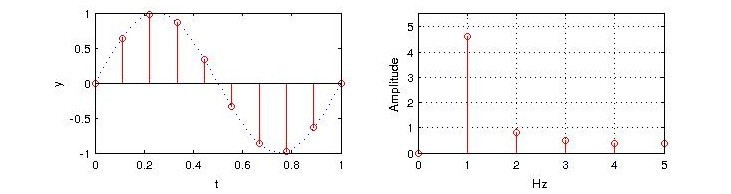
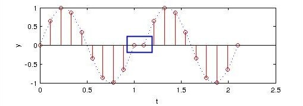
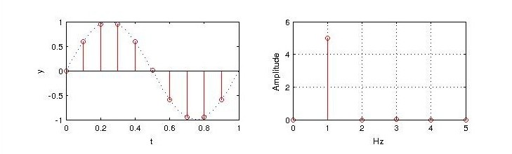
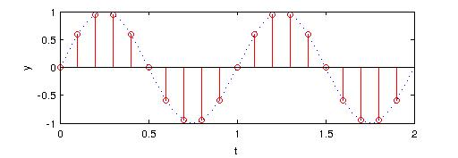

我看过很多例FFT计算中端点处理的错误，先来看以下的例子：
下图中，1Hz的周期正弦信号$sin(2\pi t)$，通过FFT计算，其功率频谱中，存在1Hz以外的信号，这显然是不对的。
在很多案例中，这一现象被忽视，或者被解释为计算误差。特别是当信号的序列足够长时，这一特征会十分的不明显。亦有一部分案例期望通过补零来优化结果。

<!-- more -->
<!-- toc -->

## 错误的原因
要分析这一错误出现的原因，需要从FFT的隐含周期性条件出发。时间域的离散化对应了频率域的周期化，而频率域的离散化对应了时间域的周期化。故由时间域的离散序列变换得到频率域的离散序列，隐含了信号在时频域皆为周期信号的约束。因此，FFT计算，实际上对应了周期化的时间序列的频谱。
针对以上时间序列信号，我们构建其周期化波形如下：

显然，周期化之后的信号并非我们预想的$sin(2\pi t)$，所以利用FFT得到的频谱显然也不是预想的1Hz。
而出现频谱泄漏，也是由$t=1$处间断引起的吉布斯效应。

## 正确的做法
那么，要得到正确的频谱，我们需要抹掉原始序列末尾的采样点：

此时，周期化对应的信号如下图，显然是我们预期的正弦信号$sin(2\pi t)$。

## 信号处理注意事项
实际信号处理中，对于采样点为$N$，采样间隔为$\delta t$的离散序列，其周期为$N\delta t$，而不是$(N-1)\delta t$。
